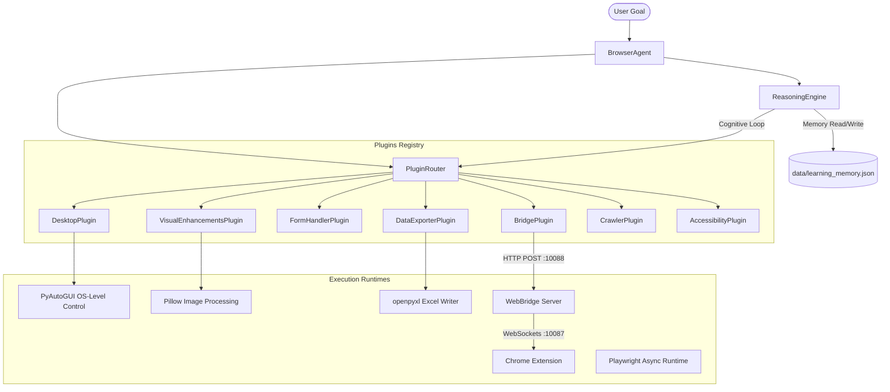

# Opencode Browser Agent

Opencode Browser Agent is a modular, AI-powered browser automation and desktop control platform. It integrates a local Playwright runtime, a Chrome Extension WebSocket bridge server for extension-level web control, an intelligent Observe-Think-Decide-Act-Verify reasoning engine, a self-learning auto-healing subsystem, and a Model Context Protocol (MCP) server for external LLM clients (such as Claude Desktop, Cursor, and VSCode).

---

## Features

### 🤖 Cognitive AI Reasoning Engine
*   **Observe-Think-Decide-Act-Verify Loop:** Decomposes complex user goals into sequence tasks using runtime visual elements and page snapshots.
*   **Self-Healing & Auto-Healing:** Automatically intercepts failed actions (like a missing selector) and attempts selector healing (via text-similarity matching) or coordinate-click fallback.
*   **Self-Learning Memory:** Saves successfully healed selector/action transformations locally to `data/learning_memory.json` to optimize execution for future runs.

### 🌐 Hybrid Browser Control Runtime
*   **Playwright Engine:** Local backend runtime for fast, asynchronous, headless or headed automation.
*   **Chrome Extension Bridge (WebBridge):** Multi-tab WebSocket & HTTP bridge facilitating low-level browser interaction (navigating, tab switching, WhatsApp automation, and DOM extraction) directly from a standard Chrome browser.
*   **Simplified DOM Extractor:** Compresses raw webpage elements into an LLM-friendly XML structure, automatically indexing interactive items with reference tags (e.g., `@e12`).

### 🔌 Extensible Plugin System
*   **Desktop Control Plugin:** OS-level control using PyAutoGUI for mouse clicks, keyboard text input, keypresses, and desktop screenshots.
*   **Intelligent Form Handler:** Natural language parsing and JSON-schema matching for auto-filling inputs, selects, radios, and checkboxes.
*   **Visual Enhancements:** Full-page scroll-and-stitch screenshots, specific DOM element cropping, visual pixel diffing with red overlays, and bounding box image annotation.
*   **Crawler Agent:** Recursive domain-locked crawling to discover links and index webpage headers and content.
*   **Accessibility Voice Control:** Speech-to-text voice assistant overlay that injects Web Speech API listeners for browser scrolling and voice-driven button clicking.
*   **Data Exporter:** Validated, schema-based data exporting to CSV, JSON, or Excel with periodic scheduling background threads.

### 🔌 Model Context Protocol (MCP) Integration
*   Exposes advanced browser automation tools directly to LLMs through an MCP Server, compatible with desktop clients like Cursor, VSCode, and Claude Desktop.

---

## Architecture

The system operates as a client-server-extension topology. The agent routes goal requests to registered plugins. Low-level actions are transmitted over HTTP/POST to the WebBridge Server, which relays commands via WebSockets directly to the browser extension running inside Chrome.



---

## Folder Structure

```
.
├── .agents/                    # Workspace agent configurations
├── .claude/                    # Tool execution and terminal hook files
├── .opencode/                  # Opencode specific metadata and skills
├── bridge/                     # WebBridge Server & CLI components
│   ├── extension/              # Chrome browser extension source code
│   ├── cli.py                  # CLI utility to send commands to the WebBridge
│   ├── server.py               # HTTP/WebSocket gateway server (Ports 10088 / 10087)
│   ├── start.ps1               # Startup script for WebBridge Server (Windows PowerShell)
│   └── status.ps1              # Health check status script for WebBridge
├── browser_runtime/            # Playwright browser automation backend
│   ├── core/                   # Browser, Session, and Page lifecycles
│   │   ├── action_executor.py  # Maps abstract action schemas to Playwright APIs
│   │   ├── browser_manager.py  # Playwright launcher wrapper
│   │   ├── context_manager.py  # Manages cookies, proxy rules, and tabs
│   │   ├── learning_loop.py    # Auto-healing engine and memory tracking
│   │   ├── page_manager.py     # Controls navigation and interactive DOM elements
│   │   └── session_manager.py  # Orchestrates multiple browser context sessions
│   ├── tools/                  # Extensible action tools (click, hover, type)
│   ├── utils/                  # DOM parsing, upload & download utilities
│   ├── config.py               # Viewport, proxy, and timeout configurations
│   └── exceptions.py           # Standard project exception declarations
├── data/                       # Local file outputs (auto-created)
│   ├── exports/                # CSV, JSON, and Excel data outputs
│   ├── screenshots/            # Page, element, and visual diff images
│   ├── scraped/                # Extracted JSON scrape files
│   └── learning_memory.json    # Self-learning loop corrections mapping
├── accessibility_plugin.py     # Web Speech API voice control plugin
├── agent.py                    # Main agent orchestration and interactive terminal
├── crawler.py                  # Domain-locked recursive crawler agent
├── data_exporter.py            # Scheduler-enabled multi-format data exporter
├── desktop_plugin.py           # PyAutoGUI-based system controls
├── form_handler.py             # Form autofill and validation module
├── mcp_config.json             # Claude Desktop MCP configuration layout
├── mcp_server.py               # Model Context Protocol server entry point
├── opencode.json               # Configures AI subagent profiles (Architect, Debugger, etc.)
├── plugin_interface.py         # Abstract base class for plugins
├── reasoning.py                # Cognitive planner logic
├── router.py                   # Plugin action router
└── visual_enhancements.py      # Screenshot stitching, diffing, and tagging
```

---

## Installation

### Requirements
*   **Python:** version `3.10` or higher
*   **Node.js:** (optional, required if compiling/developing extension assets)
*   **Operating System:** Windows, macOS, or Linux

### Step-by-Step Setup

1.  **Clone the repository:**
    ```bash
    git clone https://github.com/namana843-bit/WebForge-Agent.git
    cd WebForge-Agent
    ```

2.  **Create and activate a virtual environment:**
    *   **Windows (PowerShell):**
        ```powershell
        python -m venv venv
        .\venv\Scripts\Activate.ps1
        ```
    *   **macOS / Linux:**
        ```bash
        python3 -m venv venv
        source venv/bin/activate
        ```

3.  **Install dependencies:**
    ```bash
    pip install playwright pillow websockets openpyxl
    ```
    *(Note: Install `pyautogui` for desktop actions, which may require additional OS-level display libraries).*

4.  **Install Playwright browser binaries:**
    ```bash
    playwright install chromium
    ```

5.  **Load the Chrome Extension (WebBridge Mode):**
    *   Open Google Chrome and navigate to `chrome://extensions/`.
    *   Enable **Developer mode** (toggle in top-right).
    *   Click **Load unpacked** and select the folder `bridge/extension/` inside this project directory.

---

## Configuration

### Environment Variables
The WebBridge CLI and Agent check for:
*   `WEBBRIDGE_URL`: URL to communicate with the WebBridge server (defaults to `http://127.0.0.1:10088`).

### .env.example
Create a `.env` file in the root directory:
```env
# URL for the WebBridge server gateway
WEBBRIDGE_URL=http://127.0.0.1:10088
```

---

## Usage

### 1. Launching WebBridge Server (Backend for Extension)
To run the HTTP and WebSocket gateway servers:
*   **Windows (PowerShell):**
    ```powershell
    .\bridge\start.ps1
    ```
*   **macOS/Linux / Manual command:**
    ```bash
    python bridge/server.py --ws-port 10087 --http-port 10088
    ```

Verify status by running:
*   **Windows:** `.\bridge\status.ps1`
*   **HTTP request:** `curl http://127.0.0.1:10088/status`

### 2. Running the Interactive CLI Terminal
You can run actions directly through the interactive agent loop:
```bash
python agent.py
```
This drops you into an interactive terminal where you can type commands:
```
agent> goto github.com
agent> screenshot github_home.png
agent> goal find the search bar and type 'webbridge'
agent> exit
```

### 3. WebBridge CLI Utility
Send single command triggers directly from the shell using `bridge/cli.py`:
```bash
# Verify connection
python bridge/cli.py status

# Navigate tab
python bridge/cli.py navigate "https://news.ycombinator.com"

# Capture HTML snapshot preview
python bridge/cli.py snapshot --preview
```

---

## Example Workflows

### Open a Website and Capture Snapshot
Using the interactive terminal:
```bash
agent> goto wikipedia.org
agent> screenshot wiki.png
```

### Intelligent Form Filling (JSON Data)
Auto-fills fields on the current page by evaluating field names, IDs, placeholders, labels, and aria attributes:
```bash
agent> smart_fill {"first_name": "Alice", "email": "alice@example.com", "newsletter": true}
```

### Natural Language Form Autofill
Inferred from code (`FormHandlerPlugin.smart_fill_nl`), parses a text description into JSON via the AI page agent and populates the form:
```bash
agent> smart_fill_nl Fill the contact form for John Doe, email john@doe.com, subscribing to updates.
```

### Domain Web Crawling
Crawl up to 5 pages at a depth of 2 within the same domain:
```bash
agent> crawl https://example.com 5 2
```
*Results will automatically be stored in `data/crawls/crawl_<timestamp>.json`.*

### Data Export Scheduling
Validates a list of dictionaries against a basic data schema and schedules it to export to CSV periodically every 10 seconds:
```bash
agent> sched_export 10 csv [{"name":"Item A","price":"12.50"},{"name":"Item B","price":"9.99"}]
```

### OS-Level Desktop Action Sequence
Using the `DesktopPlugin` (requires PyAutoGUI):
```bash
# Move cursor to coordinates and click
agent> dmove 500 500
agent> dclick 500 500

# Type text into active window
agent> dwrite Hello World!
agent> dpress enter
```

---

## Technologies Used

*   **Programming Languages:** Python 3.10+, JavaScript (ES6+), HTML5, CSS3.
*   **Frameworks & Core Runtimes:** Playwright Async API.
*   **Libraries:** 
    *   `pillow` (PIL) - Visual comparisons, cropping, image manipulation.
    *   `pyautogui` - Cross-platform GUI desktop automation.
    *   `websockets` - Async WebSocket communication.
    *   `openpyxl` - Document writing for Excel spreadsheets.
*   **Protocols:** Model Context Protocol (MCP) JSON-RPC 2.0.
*   **AI Integration:** Alibaba Page-Agent / Qwen models (injected into the browser DOM via CDN script fallback for text understandings and structural extraction).

---

## Project Flow

The pipeline executes as follows from a high-level request to output:

```
[User Request/Goal]
         │
         ▼
[Reasoning Engine] ◄───────────────┐
         │ (Evaluate State)        │
         ▼                         │ (Cycle Loop)
[Observe Page State] ──────────────┤
         │ (Parse DOM snapshot)    │
         ▼                         │
[Think & Replan/Action Decided] ───┘
         │
         ▼
[Plugin Router]
         │
 ┌───────┴─────────────────────────┐
 ▼ (Local Backend)                 ▼ (WebBridge Mode)
[Playwright / Desktop / PIL]    [WebBridge Server (HTTP)]
                                           │
                                           ▼ (WebSockets)
                                [Browser Extension (DOM)]
                                           │
                                           ▼
                                [Export / Output / Screenshot]
```

1.  **Cognitive Observation:** The `ReasoningEngine` fetches a DOM layout preview through the Router (`snapshot` action).
2.  **Cognitive Evaluation (Think):** The engine routes the current state to the Page-Agent via `understand` commands to assess goal progress.
3.  **Command Selection (Decide):** The engine outputs the next target command (e.g., `click @e3` or `fill @e10 'Text'`).
4.  **Execution (Act):** The Router invokes the selected plugin. If it encounters a selector error, the `LearningLoop` runs healing diagnostics (checking for alternatives, falling back to coordinates, or waiting), then saves the successful adjustment to `data/learning_memory.json`.
5.  **Validation (Verify):** The engine validates the change (e.g., checking if the URL changed or a popup was triggered) before repeating or finishing.

---

## Plugin System

The application uses an ABC interface (`BrowserPlugin`) for structural extensibility.

### Discovery and Loading
Plugins are initialized in `BrowserAgent.__init__` and registered to the `PluginRouter` under specific namespace tags.
```python
self.router = PluginRouter()
self.router.register_plugin("desktop", DesktopPlugin(self))
```

### How to Build a New Plugin
1.  **Create a new file** (e.g., `custom_plugin.py`):
    ```python
    from plugin_interface import BrowserPlugin

    class CustomPlugin(BrowserPlugin):
        def __init__(self, agent):
            self.agent = agent

        def execute(self, action: str, **kwargs):
            if action == "custom_greet":
                name = kwargs.get("name", "User")
                return {"message": f"Hello, {name}!"}
            return {"error": f"Unknown action: {action}"}
    ```
2.  **Register the plugin** inside `BrowserAgent` in `agent.py`:
    ```python
    from custom_plugin import CustomPlugin
    # ... inside __init__ ...
    self.custom = CustomPlugin(self)
    self.router.register_plugin("custom", self.custom)
    ```
3.  **Update routing** inside `PluginRouter.route` in `router.py`:
    ```python
    elif action == "custom_greet":
        if "custom" in self.plugins:
            return self.plugins["custom"].execute(action, **kwargs)
    ```

---

## API Documentation

### `BrowserAgent` (in `agent.py`)
*   `__init__(bridge_url)`: Sets up directory layouts, initiates `PluginRouter`, instantiates all plugins (`BridgePlugin`, `DesktopPlugin`, `FormHandlerPlugin`, `VisualEnhancementsPlugin`, `DataExporterPlugin`, `CrawlerPlugin`, `AccessibilityPlugin`), and starts the `ReasoningEngine`.
*   `run_goal(goal, **kwargs)`: Sends high-level directives to the `ReasoningEngine`.
*   `navigate(url, new_tab)`: Sends navigation commands to the bridge.
*   `click(selector)`: Dispatches element clicks.
*   `fill(selector, value)`: Inputs text values.
*   `get_snapshot()`: Pulls simplified accessibility tree layouts.
*   `screenshot(name)`: Saves screen images to `data/screenshots/`.
*   `scroll_and_screenshot(scroll_steps, step_size, delay)`: Captured screenshot sequencing.
*   `scrape(instruction, output_file)`: Parses visual pages and exports structured JSON data.

### `PluginRouter` (in `router.py`)
*   `register_plugin(name, plugin)`: Hooks a plugin object into execution namespaces.
*   `route(action, **kwargs)`: Evaluates targets and forwards actions to `bridge`, `desktop`, `form`, `visual`, `exporter`, `crawler`, or `accessibility`.

### `ReasoningEngine` (in `reasoning.py`)
*   `observe()`: Captures DOM structures and forms simple XML-preview layouts.
*   `think(observation, goal, history)`: Prompts the page agent to analyze layout changes.
*   `decide(thought, goal, history, observation)`: Determines formatting action targets.
*   `act(action_text)`: Runs the target command wrapper while checking `LearningLoop` memorized corrections.
*   `verify(action_text, result, goal)`: Verifies if steps succeeded and queries the LLM page agent for goal completion.

### `LearningLoop` (in `browser_runtime/core/learning_loop.py`)
*   `get_learned_solution(url, action_text)`: Returns corrected selector history maps.
*   `record_success(url, original_action, healed_action)`: Commits working corrections to the memory file.
*   `attempt_auto_heal(router, page_url, action_text, error_msg)`: Strategy engine running fallback click processes, text similarity scans, and delay checks.

---

## Configuration Files

*   [`mcp_config.json`](file:///c:/Users/Naman/Downloads/learn%20something/broweser/mcp_config.json): Connects the `mcp_server.py` utility with Claude Desktop clients using stdio channels.
*   [`opencode.json`](file:///c:/Users/Naman/Downloads/learn%20something/broweser/opencode.json): Allocates role descriptors and LLM prompt layouts for local subagents (`architect`, `debugger`, `tester`, `scaffolder`).

---

## Error Handling

*   **Action Execution Retries:** `ActionExecutor` uses exponential backoffs (`delay *= 1.5`) up to a set limit if DOM elements are detached or page loads are slow.
*   **WebBridge Connectivity Recovery:** If WebSockets or HTTP connections disconnect, `bridge/server.py` retries connection handshakes up to 5 times at 1-second intervals before raising terminal exceptions.
*   **Self-Healing Fallbacks:** If standard selectors fail, `LearningLoop` falls back to OCR-like coordinates checks (`_get_selector_coordinates`), waiting overlays clearing, or text label tag matching.

---

## Development Guide

### How to Add a New Browser Action Tool
1.  Create a subclass of `BrowserTool` inside the `browser_runtime/tools/` directory.
2.  Implement `validate(self, arguments)`, `execute(self, page, arguments)`, and `format_result(self, raw_data)`.
3.  Add the new tool mapping to `ActionType` inside `browser_runtime/core/action_executor.py`.

### How to Add a New AI Model Integration
1.  Open `mcp_server.py`.
2.  Locate `PageAgent` instantiation (within the `extract` command handler string block).
3.  Change `model: "qwen3.5-plus"` or configure additional API key parameters.

---

## Contributing

1.  **Fork** the repository and create your feature branch: `git checkout -b feature/my-new-feature`.
2.  Follow layout architecture protocols (decouple automation tools inside `browser_runtime` and interface plugins in the root).
3.  Write tests using the `tester` agent sub-profile (utilizing `pytest`).
4.  Submit a **Pull Request** explaining changes and attaching screenshot test runs if styling has changed.

---

## Future Roadmap

*   [ ] **Cross-Browser WebBridge Support:** Extend WebSocket adapters to support Firefox and WebKit runtimes in extension mode.
*   [ ] **Local Multimodal Fallback:** Integrate local visual screenshot checks using open-source Vision LLMs instead of CDN-injected Alibaba Page-Agent dependencies.
*   [ ] **CAPTCHA Auto-solving Integration:** Add automated notification alerts or solver hooks to the `StateValidator` CAPTCHA scanner.

---

## License

This project is licensed under the MIT License - see the LICENSE placeholder for details.
